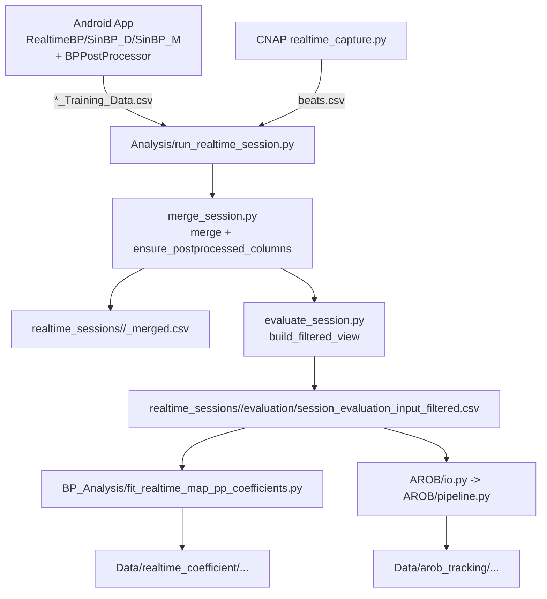

# BP推定パイプライン実装アーキテクチャ（2026-04-16）

## 1. 対象と前提

- 比較対象手法は `RTBP / SinBP(D) / SinBP(M)` の3手法
- ユーザー要望: Analysis側は `raw` 基準を維持しつつ、一貫性を確認
- 確認対象:
  - App実装（`RealTime-IBI-BP/app/...`）
  - realtime session（`run_realtime_session.py` + `realtime_pipeline/`）
  - realtime coefficient（`run_realtime_coefficient_pipeline.py`）
  - AROB解析（`run_arob_tracking_analysis.py` + `Analysis/AROB/`）

---

## 2. 依存関係図（データ/処理フロー）

---

## 3. 各層の実装と前処理

## 3.1 App（算出と保存）

- 算出本体:
  - `RealtimeBP.java`
  - `SinBPDistortion.java`
  - `SinBPModel.java`
- 共通後段:
  - `BPPostProcessor.java`
  - `SBP/DBP -> MAP/PP -> EWMA(alpha_map=0.30, alpha_pp=0.50) -> SBP/DBP再構成`
- 保存:
  - `GreenValueAnalyzer.java` が `*_Training_Data.csv` を出力
  - 3手法それぞれに `*_SBP_raw`（現在は clamp後値）と `*_SBP_smoothed`（後段処理値）等を保持
  - 追加済みキー: `sbp_process/dbp_process`（ログJSON）

## 3.2 realtime session

- エントリ: `run_realtime_session.py`
- 役割:
  - adb/CNAPの起動停止、ログ表示、CSV回収
  - `merge_session.py` で app+CNAP を時刻同期
  - `evaluate_session.py` で session単位評価
- 重要:
  - `merge_session.py` 内で `ensure_postprocessed_columns()` が呼ばれる
  - `map_pp_runtime.append_runtime_map_pp_columns()` は呼ばれるが、現在は
    - `preserve_existing_core_columns=True`
    - `enable_tracking_blend_overrides=False`
    を固定指定しており、`M1/M2/M3` の既存列（App由来）をデフォルトで上書きしない

## 3.3 realtime coefficient

- エントリ: `run_realtime_coefficient_pipeline.py`
- 実体: `BP_Analysis/fit_realtime_map_pp_coefficients.py`
- 入力:
  - `session_filtered_input.py` の `ensure_session_input_filtered()` を経由
  - `session_evaluation_input_filtered.csv` を単一入力として再利用
  - 現在は `ensure_session_input_filtered(force_rebuild=True)` が既定で、毎回 `merged.csv` から再生成して旧キャッシュ混入を防止
- 既定系列:
  - `current_app_smoothed`
  - `refit_map_pp_smoothed`
  - `leave_one_session_out`

## 3.4 AROB解析

- エントリ: `run_arob_tracking_analysis.py`
- 入力:
  - `AROB/io.py` が `ensure_session_input_filtered()` を利用（realtime/coefficientと同じ入力源）
- 追加処理（AROB固有）は現在フラグで明示有効化:
  - `--enable-tracking-projection`
  - `--enable-window-lag-alignment`
- デフォルト（フラグなし）は追加補正を入れず、window集約後に centered/delta/detrended 系指標を計算

---

## 4. 一貫性チェック結果

## 4.1 一貫している点

- 手法セットは3手法に統一されている
  - `RTBP / SinBP_D / SinBP_M`
- coefficient と AROB は同じ前処理入力
  - `session_evaluation_input_filtered.csv` を共用
- CNAP外れ値フィルタ（`ref_pp_inlier`）は realtime evaluation 側で共通化

## 4.2 不一致が残りうる点（要注意）

1. **rawという語の意味は用途で違う**
- `*_SBP_raw`: clamp後の拍ごとBP（SBP/DBP）
- `*_SBP` : クランプ後（後段EWMA前）
- `*_SBP_smoothed`: 後段EWMA後
- Analysis内の `series=raw` は通常 `*_SBP` を指し、`*_SBP_raw` ではない（値はほぼ同じだが系列定義が異なる）

2. **AROBの追加補正は任意**
- フラグをONにした実行結果は、realtime/coefficientの素の比較と完全一致しない
- 比較実験時は、フラグON/OFFをメタデータで区別して扱う必要がある

3. **非コア系列（例: EOnly/E2/LocalA）の再計算列は必要時のみ扱う**
- コア3手法に比べて、列の存在可否がセッションで異なる場合がある
- 論文比較は `RTBP / SinBP_D / SinBP_M` を主系列として固定する

## 4.3 二重処理の有無

- コア3手法については、現在デフォルトで
  - App側後段処理（MAP/PP EWMA）はそのまま保持
  - Analysis側での `M1/M2/M3` 上書きは抑止
- したがって、realtime session / coefficient の `current` は App 出力を基準に評価される
- AROBの追加処理はフラグON時のみ有効

---

## 5. 変更後の運用ルール

- realtime session / coefficient:
  - コア3手法は App 由来列を優先
  - `map_pp_runtime` は不足列補完のみを担当（既存コア列は保持）
- AROB:
  - デフォルトは補正なし（公平比較）
  - 追加補正を使う場合は CLI フラグを明示し、結果を別runとして保存

---

## 6. まとめ（現状判定）

- **手法セットと入力源は統一済み**（`RTBP / SinBP_D / SinBP_M`、`session_evaluation_input_filtered.csv` 共通）
- **主要な一貫性ギャップは実装で是正済み**
  - `map_pp_runtime` のコア列上書きをデフォルト抑止
  - AROB追加補正をデフォルトOFF化し、CLIフラグで明示実行
- 残る注意点は、`raw` 列の意味定義と、AROB補正ON runの解釈を混同しないこと
